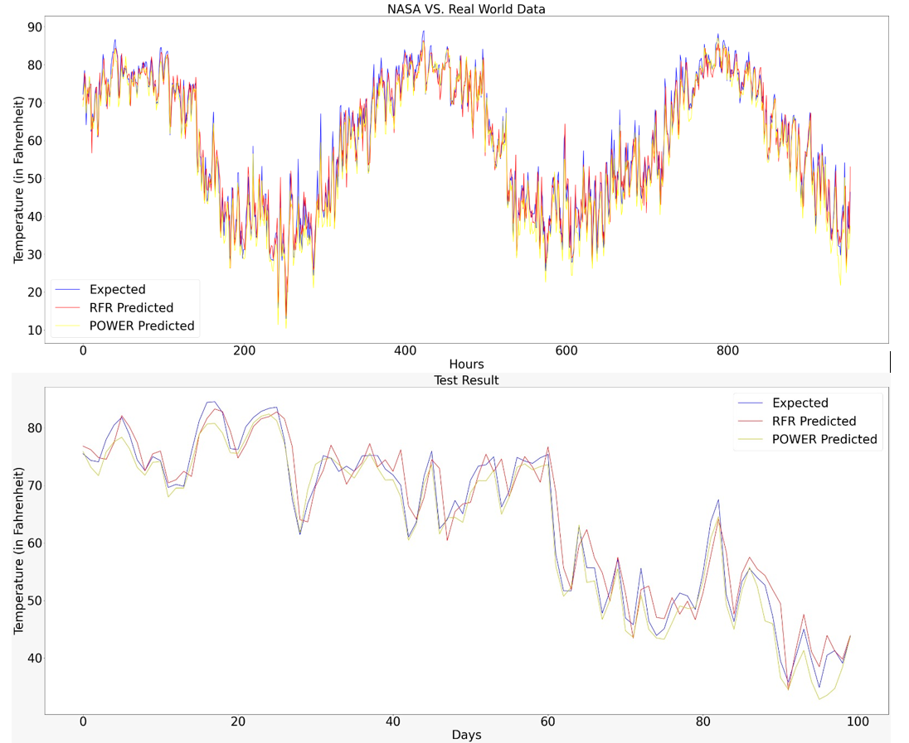

# Weather_Forecasting
Weather Forecasting Project

Project utilizes historical data from Land-Based Weather Stations, in order to forecast weather on the hourly and daily basis. This analysis involves Time Series Supervised Learning and uses LSTM and Decision Trees as its model base.

* Comparison with NASA's Power Model for daily predictions:

